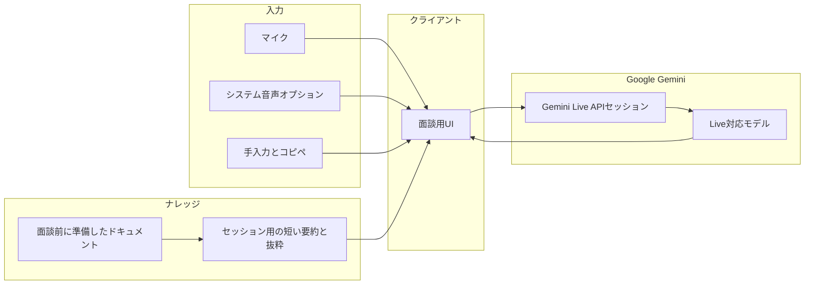

# 面談コパイロット実装計画（Gemini Live API 基準）

最終更新: 2026-05-01

## 1. 目的

Zoom / Teams 等の面談中に、**先方の発言**（および必要なら自分のメモ）を入力として取り込み、**あらかじめ用意した面談用ドキュメント**に根拠を寄せた**回答案（こちらが話す内容のたたき台）を、できるだけ会話の流れが途切れないタイミング**で提示する。

- **正式な回答の主軸**: 先方の発言・質問に対する応答。
- **コンテキスト**: 自分の短いメモ・追加状況も含め、ただし出力は面接官向けの話し言葉／フォーマルさを優先。

## 2. 技術方針の確定事項

| 項目         | 決定                                                           |
| ---------- | ------------------------------------------------------------ |
| リアルタイム対話   | **Gemini Live API**（ネイティブ音声モデル等、公式が Live 向けに案内するモデルを採用）      |
| 課金         | **Gemini（Google）側に集約**。OpenAI Whisper 等の別ベンダー課金は採用しない        |
| 回答の出し方（推奨） | まずは **テキストで回答案を表示**。モデル音声読み上げ（TTS）は必須にしない（コスト・用途に合わせ後から追加可能） |
| 補助入力       | ライブ音声に加え、**テキスト貼り付け・手入力**を常に併用可能にする                          |

## 3. Live API を選ぶ理由（要約）

- **低遅延のストリーミング**で、録音チャンクを都度 REST に送る方式より **会話の間合い**に寄せやすい。
- **音声入力とテキスト指示を同一セッション**で扱いやすい。
- **課金を Gemini のみ**にできる（Whisper 等と組み合わせない）。

制約・注意は後述の「リスク・論点」を参照。

## 4. アーキテクチャ概要

- **クライアント**が Live セッションを確立し、マイク（および任意でシステム音声）・テキストを送る。
- **準備ドキュメント**はそのまま全量を毎ターン載せず、**面談前またはセッション開始時**に **要約・構造化・短い抜粋**に落とし、セッションに載せる **テキスト量を抑える**（課金と安定性の両面）。

## 5. 音声入力の現実的な取り方

| 方式         | 内容                          | メリット                   | デメリット                      |
| ---------- | --------------------------- | ---------------------- | -------------------------- |
| A. マイクのみ   | 機器のデフォルト入力                  | セットアップが簡単              | **先方の声は弱く**、自分の声が主になりやすい   |
| B. システム音声  | BlackHole 等で**会議アプリの出力**を入力 | 先方の発言を**音声として**取り込みやすい | OS 別セットアップ、遅延・ルーティングの確認が必要 |
| C. 手入力・コピペ | Zoom / Teams の**字幕・メモから貼る** | 確実に「先方の文言」が取れる         | ライブ感は人力に依存                 |

**推奨**: 実装は **A + C を必須**、本番運用で品質が足りなければ **B をオプション**として手順書化する。

## 6. 準備ドキュメント（ナレッジ）の扱い

1. **アップロード or 貼り付け**（Markdown / テキスト / PDF は実装時に対応形式を決定）。
2. 面談開始前に **1 回、またはセッション直前に 1 回**、`generateContent` 等で **要約・質問想定・禁止事項・トーン**を構造化（**Live に載せるのは圧縮版**）。
3. 面談中は **差分だけ**テキストで補足（例:「先方が○○社と言った」）できる UI を用意。

Live API では **セッションコンテキストがターンをまたいで蓄積**され、課金・上限に影響しやすい。**長文を毎ターン積み増えしない**設計を原則とする。

## 7. プロンプト設計（要件レベル）

- **役割**: 面接の「回答案」を出すアシスタント。幻覚を避け、**ドキュメントにない内容は推測と明示／省略**。
- **優先順位**: 直近の**先方の発言・質問**に直接答える。自分メモは補足。
- **文体**: フォーマル、簡潔、話し言葉用の短文と、必要なら箇条書きの要点の両方を出せるようにする（UI で切替でも可）。
- **安全**: 個人情報・契約・法務に触れる場合は「確認が必要」と明示するなど、ガードレールを system instruction に含める。

## 8. 料金の目安（参考）

公式: [Gemini API の料金](https://ai.google.dev/gemini-api/docs/pricing)

- **Gemini 3.1 Flash Live Preview** には、音声について **USD $0.005 / 分（入力）** 等の **分単価** が掲載されている（モデル・枠により変動。最新表を優先）。
- **テキスト出力中心**にすれば、音声出力の分単価は抑えやすい。
- **長時間セッション + 肥大したコンテキスト**では、トークン課金が上振れしうる。→ **ナレッジ短縮・履歴の整理方針**がコスト対策になる。

※ 実コストは **短時間の試走**と Cloud / AI Studio の利用レポートで確認する。

## 9. セキュリティ・コンプライアンス

- **API キーはクライアントに埋め込まない**（プロトタイプ以外は **バックエンドまたは BFF** 経由で Live に接続し、キーをサーバー側のみに置く）。
- 面談内容は機微。利用規約・データ保持ポリシー・ログの保存有無を明示し、**必要最小限のログ**にする。
- 先方の録音・転写には**相手・会議のポリシー**に注意（利用国・会社・相手の同意）。

## 10. 実装フェーズ案

### フェーズ 0: 検証（1〜2 日規模）

- Google AI Studio または最小コードで **Live セッション接続**、マイク入力 → テキスト応答を確認。
- 短い**面談メモ**を system / context に入れ、回答がメモに沿うか確認。

### フェーズ 1: MVP

- Web アプリ（例: Next.js）: **Live 接続**、**テキスト回答表示**、**手入力・貼り付け欄**、**ナレッジ登録（テキスト）**。
- セッション開始時の **ナレッジ圧縮（バッチ `generateContent`）**。
- **再接続・エラー表示**の最低限。

### フェーズ 2: 運用強化

- **システム音声**オプションのセットアップ手順（macOS 向けドキュメント）。
- 応答モード（短文 / 詳細）、**会話ログのエクスポート（任意・ローカル優先）**。
- コンテキストが長くなったときの **リセット or 要約の差し込み**。

## 11. リスク・論点チェックリスト

- 先方音声を **どの入力経路で**取るか（マイク / システム音声 / コピペ）をユーザーが選べるか。
- **コンテキスト窓**と課金（ターンごとの累積）の扱いを設計で明文化したか。
- **オフライン・API 障害**時のフォールバック（手入力のみ、ローカルメモ）があるか。
- **モデル・エンドポイント名**は GA / Preview の変更に追従できるか。

## 12. 次のアクション（実装開始時）

1. 採用する **Live 対応モデル名**を公式ドキュメントで確定する。
2. 接続方式（**ブラウザから直接 vs サーバー中継**）を決める。
3. 本リポジトリに **フェーズ 1 の骨格**（ルーティング、環境変数、Live 接続の 1 パス）を追加する。

---

この計画は会話上の合意（**Live API 基盤・Gemini 課金に集約・スムーズな会話体験優先**）を反映している。変更時は本ファイルを更新し、日付を変えること。

## 13. 実装状況（コードベース）

リポジトリ内に以下を配置済みです。

- **UI**: Next.js App Router（`[app/page.tsx](../app/page.tsx)`、`[components/CopilotClient.tsx](../components/CopilotClient.tsx)`）
- **ナレッジ要約 API**: `[app/api/brief/route.ts](../app/api/brief/route.ts)`（`generateContent` / `gemini-2.0-flash`）
- **Live 中継**: `[server/live-proxy.ts](../server/live-proxy.ts)`（`ws` + `@google/genai` の `live.connect`）
- **手順書**: [WALKTHROUGH.md](./WALKTHROUGH.md)

起動はリポジトリ直下で `npm run dev`（Next とプロキシの同時起動）。環境変数は `.env.local`（`.env.example` 参照）。

### UI（frontend-design スキル適用）

- **方向性**: 面談・編集室を意識した**エディトリアル／上質な実務 UI**（汎用 AI っぽい青紫グラデ・システムフォント一色を避ける）。
- **タイポグラフィ**: `next/font/google` で **Shippori Mincho**（見出し）と **Zen Kaku Gothic New**（本文）を適用。
- **色・質感**: インク系ダークベース＋**アンティークゴールド**アクセント、薄いノイズオーバーレイと多層ラジアルで奥行き。
- **モーション**: セクションの**段階的フェードイン**（`animation-delay`）、接続状態ラベルのパルス。
- **実装箇所**: `[app/globals.css](../app/globals.css)`（トークン・コンポーネントクラス）、`[app/layout.tsx](../app/layout.tsx)`、`[app/page.tsx](../app/page.tsx)`、`[components/CopilotClient.tsx](../components/CopilotClient.tsx)`。

